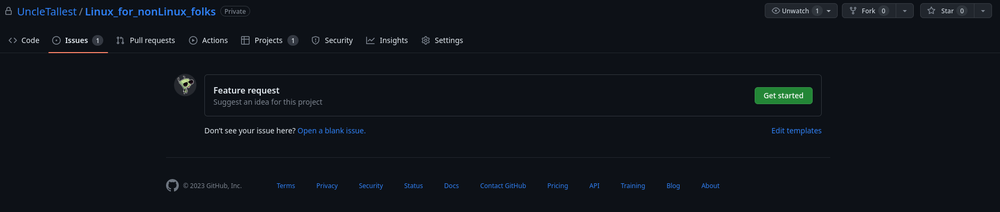

#### Welcome to Linux for nonLinux Folks!

---

##### Introduction

I seem to spend a considerable amount of time on occasion fixing and/or explaining how to fix Linux for my less knowledgeable friends. Trust me when I say, it is not that these folks aren't smart enough to use Linux properly. 

There are just so many ways you can literally shoot yourself in the foot with any operating system; Linux just gives you the complete toolkit to do said shooting and says "Go have fun!" - normally without any safety mechanisms in place to keep you from harm. 

---

##### Overview

This set of documents is my attempt to give you some useful advice so you can take care of most of these things on your own without angering your old neckbeard friends who seem to do this stuff in their sleep and always seem cranky. 

I fully anticipate some of you will keep asking for my help; think of these documents as a first step in that process. 

Who knows, you might learn something useful in here. :smirk:

---

##### Structure

This repository of knowledge is divided by the `families` that distributions (hereinafter referred to by the short form of `distros`) tend to fall into in this modern age.

The primary three families are `Debian` (and its derivatives), `RedHat` (and its  derivatives), and `SUSE` (and its derivatives). These will be referenced in `debian-and-derivatives`, `redhat-and-derivatives`, and `suse-and-derivatives`

Smaller families are grouped together under the umbrella of `other-distributions`. These include `Arch`, `Gentoo`, and `Slackware` (and, of course, their derivatives).

---

##### How to best use this trove of documents?

This entire repository of knowledge is written in Markdown to make a legible, easy-to-read storehouse of information. While they can be read in any text editor, I personally recommend [Marktext](https://github.com/marktext/marktext) for viewing them as the formatting included within these documents will make them difficult to read in a standard text editor. Installation instructions are available through the link as well as in the `installing_apps.md` file within each distro family subsection of this repository.

---

##### Making a request for new data

If you find yourself with an issue not yet covered in the currently existing set of documents, feel free to make a 'feature request' on the repository [here](https://github.com/UncleTallest/Linux_for_nonLinux_folks/issues/new/choose). Just hit the `Get Started` button show below and follow the instructions. 

---

continue on to the [Table of Contents](./pages/projector.html?src=../markdown/table-of-contents.md)

